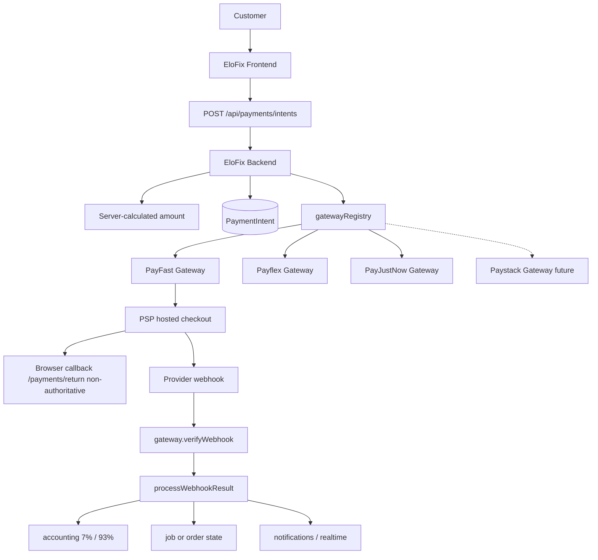

# ELOFIX PHASE D1 — PAYSTACK ARCHITECTURE & CAPABILITY AUDIT

AUDIT ONLY. Paystack was not implemented. No packages, routes, controllers, webhook handlers, schema edits, migrations, env changes, hosted changes, transactions, commits, or PRs were made during D1.

---

## 1. Repository State

Branch:
`main`

SHA:
`5d7436470b2fac12471f2dc6b6ce90caeea0eeb5`

Working tree:
`git.exe` was not available on PATH in the audit shell, so `git status` could not be executed. `.git/HEAD` points at `refs/heads/main`. Reflog shows a checkout from `phase-b-hosted-staging-validation` onto `main`. No files were deleted, reset, or overwritten for D1. No D1 implementation branch was created because D1 must not modify payment source.

Phase B:
Present on current `main`. Phase A/B work was not recreated.

---

## 2. Current Payment Architecture

EloFix already has a multi-gateway **PaymentIntent** pipeline. PayFast, Payflex, and PayJustNow are adapters. 50/50 schedules and 7%/93% splits live in EloFix settlement/accounting, not in the PSP.

This diagram matches the repository. Adding Paystack is an adapter plus a small provider enum, not a rewrite.

Legacy job-scoped Paystack code in `elofix-backend/src/services/payment.service.js` (`verifyPaystackAndSettleLabor`, models `PaystackCharge` / `PaystackWebhookEvent`) is **not wired to routes**. D2 must not revive that path.

---

## 3. Existing PaymentIntent Model

Authoritative definitions are in `elofix-backend/prisma/schema.prisma`. Do not assume `MATERIALS_DELIVERY` exists.

### Enums

PaymentProvider:
`PAYFAST`, `PAYFLEX`, `PAYJUSTNOW`

There is **no** `PAYSTACK` value today.

PaymentIntentKind:
`LABOR`, `MATERIAL_ORDER`, `JOB_STORE_ORDER`, `DELIVERY_FEE`, `PROVIDER_REFUND_REPAYMENT`

PaymentType:
`DEPOSIT`, `COMPLETION`, `FULL_UPFRONT`, `FULL_COMPLETION`, `MATERIAL_ORDER`, `DELIVERY_FEE`, `JOB_STORE_ORDER`

PaymentState:
`PENDING`, `PROCESSING`, `PAID`, `FAILED`, `CANCELLED`, `REFUNDED`, `PARTIALLY_REFUNDED`, `DISPUTED`

CategoryPaymentMode:
`TWO_PAYMENT_50_50`, `SINGLE_PAYMENT_UPFRONT`, `SINGLE_PAYMENT_ON_COMPLETION`

JobPaymentProgress:
`NONE`, `FIRST_PAID`, `FULLY_PAID`

### PaymentIntent fields relevant to Paystack

- `id`
- `merchantReference` (unique)
- `provider`
- `kind`
- `paymentType`
- `userId`
- `jobId`
- `materialOrderId`
- `recipientUserId`
- `amount` Decimal(12, 2)
- `commissionAmount`
- `recipientAmount`
- `currency` default `ZAR`
- `state`
- `gatewayTransactionId`
- `gatewayPayload`
- `idempotencyKey`
- `returnUrl`
- `cancelUrl`
- `paidAt` / `failedAt` / `cancelledAt` / `refundedAt`
- `refundedAmount`

Idempotent webhooks: `PaymentWebhookEvent` unique on `[provider, externalEventId]`.

### Migration classification

**SMALL MIGRATION REQUIRED**

Postgres/Prisma must add enum value `PAYSTACK` to `PaymentProvider` (also used on banking `gatewayProvider`). No structural rewrite of `PaymentIntent` is required for Model B collection. `merchantReference` can be sent as Paystack `reference`. `gatewayTransactionId` can store Paystack `data.id` as a string.

Delivery is **not** `MATERIALS_DELIVERY`. It is `kind=DELIVERY_FEE` / `paymentType=DELIVERY_FEE`.

---

## 4. Existing Payment Provider Abstraction

A true adapter layer exists.

Generic:
- `ENABLED_PAYMENT_PROVIDERS` in `elofix-backend/src/services/payments/paymentConfig.js`
- `normalizeProvider` / `getGateway` / `listEnabledGateways` in `elofix-backend/src/services/payments/gatewayRegistry.js`
- Contract in `elofix-backend/src/services/payments/gateway.interface.js`: `createCheckout` → `{ type: 'redirect', url, formFields?, method? }`; `verifyWebhook`; `refund`; marketplace stubs
- Customer selects provider; backend persists `PaymentIntent.provider`
- Shared settlement: `webhook.service.processWebhookResult`

PayFast-specific:
- Form POST checkout
- ITN MD5 + IP CIDR + server validate
- `confirmPaymentReturn` sandbox settle is PayFast-only and forced off in production

There is **no silent failover** after a PaymentIntent is initialized with one provider.

---

## 5. Current Payment Flows

Shared path:

UI `PaymentModal.handlePayment`
→ `POST /api/payments/intents`
→ `payment.controller.createPaymentIntent`
→ `paymentIntent.service.createPaymentIntent`
→ `getGateway(provider)`
→ `gw.createCheckout(intent, customer)`
→ hosted checkout

Webhook:

`POST /api/payments/webhooks/payfast`
→ `payment.controller.payfastWebhook`
→ `webhook.service.handlePayfastWebhook`
→ `payfast.gateway.verifyWebhook`
→ `processWebhookResult` (Prisma Serializable transaction)

Return:

`/payments/return?intentId=`
→ `POST /api/payments/intents/:id/confirm-return`
→ production does **not** settle

Client `amount` is a hint only. Mismatch returns 400. Controller does not accept `paymentType` or `commissionAmount` from the body.

### A. DEPOSIT

UI action: `frontend/src/pages/user/JobDetail.tsx` when `nextLaborPaymentType === DEPOSIT`

API: `POST /api/payments/intents` (`kind: LABOR`)

Controller: `createPaymentIntent`

Service: `paymentIntent.service.createPaymentIntent` resolves `paymentType=DEPOSIT` and amount = `job.firstPaymentAmount`

PaymentIntent: `kind=LABOR`, `paymentType=DEPOSIT`, `merchantReference=EF-…`, `state=PENDING`

Gateway: `payfast.gateway.createCheckout`; `m_payment_id = merchantReference`

Webhook: PayFast ITN → `processWebhookResult`

Settlement: `escrowSettlement.settleLaborFromIntent` → `settlement.service.settleLaborTransactionInTx`

Accounting: `money.util.splitCommission` on the deposit tranche only

Notification: `notifyDepositPaymentSuccess`

Job state: `paymentProgress=FIRST_PAID`, `laborPaid=true`

Realtime: no `domain:payment/paid` on this path; return page polls REST

### B. COMPLETION

Same intent API. Server resolves `paymentType=COMPLETION` and amount = `job.secondPaymentAmount` after provider `AWAITING_CONFIRMATION`.

Settlement sets `paymentProgress=FULLY_PAID`. May call `customerPaymentObligation.service.markObligationPaidForJob`, which emits `domain:update` `{ domain: 'payment', action: 'obligation-paid' }`.

### C. MATERIALS

Standalone: `kind=MATERIAL_ORDER`, amount = materials subtotal → `settleMaterialOrderFromIntent` (7% platform / 93% supplier) → `branchSettlement.initiateSettlementAfterPayment`.

Job store: `kind=JOB_STORE_ORDER`. In-transaction material settle if `materialOrderId` is present; otherwise post-transaction `settleJobStoreOrderFromIntent`.

### D. MATERIALS_DELIVERY (actual code: `DELIVERY_FEE`)

UI: `OrderDetails.tsx`, `DeliveryRequestDetail.tsx`, `JobDetail.tsx`, `JobDeliverySection.tsx` with `kind=DELIVERY_FEE`.

Requires approved `deliveryRequest` when `metadata.deliveryRequestId` is set. Amount is `quotedFee` or persisted delivery fee.

Post-settlement: `escrowSettlement.settleDeliveryFeeFromIntent` → `deliveryRequest.service.applyDeliveryPayment`.

TWO_PAYMENT_50_50 lives in `paymentMode.service.js` and `money.util.splitFiftyFiftySchedule` (floor first half, remainder second).

---

## 6. Current Settlement Architecture

7%/93% is **internal accounting**, not a PSP bank split.

Labor: `splitCommission()` in `elofix-backend/src/services/payments/money.util.js` (default `PLATFORM_COMMISSION_RATE=0.07`, cents-rounded) inside `settleLaborTransactionInTx`.

Materials: `escrowSettlement.settleMaterialOrderFromIntent` uses 0.07 of subtotal; remainder is supplier earning.

Intent stamps `commissionAmount` / `recipientAmount`. A `CommissionLedger` row is written.

All current gateways return `supportsMarketplaceSettlement() === false`.

For a R1,000 `TWO_PAYMENT_50_50` job the ledger is still:

- Deposit R500 → EloFix R35 / provider R465
- Completion R500 → EloFix R35 / provider R465
- Customer R1,000; EloFix R70; provider R930

PSP fees are not subtracted inside `splitCommission`.

---

## 7. Idempotency Architecture

merchantReference:
EloFix-generated unique `EF-` + 20 hex chars. PayFast uses it as `m_payment_id`. Webhook lookup key.

externalEventId:
`PaymentWebhookEvent` unique on `[provider, externalEventId]`. Already-PAID intents short-circuit.

gatewayTransactionId:
PSP transaction id (`pf_payment_id` for PayFast).

Create-intent:
`Idempotency-Key` header + `IdempotencyRecord`.

Webhook isolation:
Prisma `Serializable`.

### Recommended Paystack mapping

- Keep EloFix-generated `merchantReference`
- Send it as Paystack Initialize `reference` (alphanumeric and `-` are allowed)
- Store Paystack `data.id` in `gatewayTransactionId` as a string (Paystack warns this is a 64-bit id)
- `externalEventId` = `charge.success:{data.id}` so refund events cannot re-settle
- Browser callback `trxref` / `reference` must never settle

---

## 8. Paystack Official Integration Requirements

Consulted official Paystack documentation: Accept Payments, Transaction API, Webhooks, Split Payments, Multi-split, Subaccounts, Refunds, Verify Payments, Metadata, SA currency/subunit notes.

Initialize:
`POST https://api.paystack.co/transaction/initialize`
Requires `email`, `amount` in subunits. Optional `currency`, `reference`, `callback_url`, `metadata`, `subaccount`, `split_code`, `split`, `bearer`.

Verify:
`GET /transaction/verify/:reference`
Use status `success`. Amount is in cents. Currency is ISO.

Webhook:
Success event is `charge.success`. Return HTTP 200 or Paystack retries (live: every 3 minutes for 4 tries, then hourly for 72 hours; test: hourly for 10 hours, 30s timeout).

Signature:
`x-paystack-signature` = HMAC-SHA512 of the raw body using the integration **secret key**. No separate webhook secret is required.

HMAC pitfall:
The official Node sample hashes `JSON.stringify(req.body)` after Express JSON parsing. That is unsafe. EloFix legacy `verifyPaystackSignature(rawBody)` already hashes the Buffer with `timingSafeEqual`. D2 must use `express.raw` before `express.json()`, matching Payflex.

Amount:
ZAR cents. R150.00 → 15000. Minimum R1.00.

Currency:
`ZAR`.

Callback:
Informational. Paystack appends `reference` and `trxref`.

---

## 9. Paystack → EloFix Mapping

| EloFix concept | Current implementation | Paystack concept | Change required |
| --- | --- | --- | --- |
| PaymentIntent | Unified ledger | Transaction | Add `PAYSTACK` provider enum |
| merchantReference | Unique `EF-…` | Initialize `reference` | Send EloFix value; do not autogen |
| provider | `PAYFAST` / `PAYFLEX` / `PAYJUSTNOW` | Paystack integration | Small enum migration |
| DEPOSIT | `PaymentType` on `LABOR` | metadata only | None to business rules |
| COMPLETION | `PaymentType` on `LABOR` | metadata only | None to business rules |
| MATERIALS | `MATERIAL_ORDER` / `JOB_STORE_ORDER` | metadata `kind` | None to business rules |
| MATERIALS_DELIVERY | **Not an enum**; use `DELIVERY_FEE` | metadata `kind` | None; do not invent a new type |
| webhook | PayFast ITN / Payflex raw JSON | `POST /api/payments/webhooks/paystack` | New route + adapter |
| externalEventId | `[provider, externalEventId]` unique | `charge.success:{data.id}` | Reuse `PaymentWebhookEvent` |
| settlement | `processWebhookResult` | After verify + amount/currency | Reuse; do not duplicate |
| refund | `refund.service` → `gw.refund()` | `POST /refund` in cents | Adapter method only |
| provider share | `splitCommission` 93% | Optional later split | Keep ledger even if no PSP split |
| supplier share | material 93% | Optional later split | Keep ledger even if no PSP split |
| callback | `/payments/return` | `callback_url` | Share return page; poll only |
| reconciliation | None vs PSP | Verify Transaction | Future admin + scheduled job |

---

## 10. Proposed Paystack Initialization Architecture

No D1 code.

D2 `paystack.gateway.createCheckout(intent, customer)` should POST Initialize with:

- `email` from the server-side customer record
- `amount` = `toCents(intent.amount)` at the gateway boundary only (`money.util.js`)
- `currency` = intent / `PAYMENT_CURRENCY` (`ZAR`)
- `reference` = `intent.merchantReference`
- `callback_url` = existing `intent.returnUrl` (`/payments/return?intentId=…`)
- `metadata` (non-sensitive): `paymentIntentId`, `kind`, `paymentType`, `jobId` or `materialOrderId`

Return `{ type: 'redirect', url: authorization_url, method: 'GET' }`. `frontend/src/lib/paymentCheckout.ts` already redirects when `url` is present without `formFields`.

Do not send secrets, banking details, identity documents, or internal authorization data.

Do not pass `subaccount` or `split` until Model A is separately authorized.

---

## 11. Proposed Paystack Webhook Architecture

`POST /api/payments/webhooks/paystack` in `elofix-backend/src/app.js` **before** `express.json()`, using `express.raw({ type: 'application/json' })`.

1. Receive raw body
2. Read `x-paystack-signature`
3. HMAC-SHA512 with secret key + `timingSafeEqual`
4. Reject invalid signatures
5. Handle `charge.success` (other events ignored or routed later for refunds)
6. Locate PaymentIntent by `data.reference` = `merchantReference`
7. Call Verify Transaction
8. Verify status `success`
9. Verify amount in cents equals `toCents(intent.amount)`
10. Verify currency `ZAR`
11. Ensure intent is payable (`PENDING` / `PROCESSING`; already `PAID` is an idempotent no-op)
12. Enforce `PaymentWebhookEvent` uniqueness
13. Settle via existing `processWebhookResult('PAYSTACK', …)`
14. Persist `externalEventId`
15. Existing notifications and state transitions run from current settlement
16. Return 401/403 for bad HMAC; return 200 for authenticated unknown/duplicate events so retries stop

Express risk: mounting this route after `express.json()` would break or weaken signature validation. Payflex/PayJustNow already demonstrate the correct ordering.

ONE settlement authority: webhook → verify → `processWebhookResult`. Browser callback is not a settlement authority.

---

## 12. Callback / Return Architecture

Callback is non-authoritative in production.

`paymentIntent.service.confirmPaymentReturn` settles only when `provider === PAYFAST` **and** `payfastSettleOnReturn()` is true. That helper is forced **false** when `NODE_ENV=production`. Covered by `confirmPaymentReturn.production.test.js` and `paymentConfig.failClosed.test.js`.

Paystack should share `/payments/return`. Extra Paystack query params are unused. D2 must not add a Paystack settle-on-return path.

Target:

Paystack → EloFix `/payments/return?intentId=` → display Processing → backend reads PaymentIntent state → webhook/verification determines PAID.

Reusable page: `frontend/src/pages/payments/PaymentReturn.tsx`.

---

## 13. ZAR / Subunit Handling

EloFix stores major units as Decimal(12, 2). Paystack expects integer cents.

Conversion belongs **only** in `paystack.gateway.js` using existing `toCents` / `fromCents`.

Example: R150.00 → 15000 cents (`Math.round(150 * 100)`).

Webhook/verify should compare Paystack `amount` (cents) to `toCents(intent.amount)` with zero-cent tolerance, which is stricter than the shared webhook ±0.02 major-unit check.

Do not change `splitCommission` or 50/50 math.

Shared `processWebhookResult` currently does not validate currency. The Paystack adapter must reject non-ZAR before calling shared settlement.

---

## 14. Split Payments / Subaccounts

CAPABILITY IN PAYSTACK API:
**YES**

Official APIs: create subaccount, Initialize with `subaccount` or `split_code`, dynamic/multi-split, `transaction_charge`, `bearer`.

CONFIRMED ENABLED FOR ELOFIX ACCOUNT:
**REQUIRES OPERATOR CONFIRMATION**

Operator reported the live dashboard visibly includes Transaction Splits, Subaccounts, Payouts, Transfers, Recipients, Refunds, and Disputes. That is dashboard visibility, not an API proof. D1 did not create a subaccount, split, transfer, or charge.

Operator confirmation still required for:

- Test-mode `POST /subaccount` with a South African bank
- `GET /bank?country=south_africa` codes usable by EloFix
- Initialize with `subaccount` or dynamic `split` on this integration
- Refund of a split transaction

---

## 15. 7% / 93% Settlement Decision

### MODEL A — Paystack Split Payment

Customer → Paystack → 7% EloFix / 93% provider or supplier at charge time.

### MODEL B — 100% to EloFix merchant

Paystack settles 100% to EloFix. EloFix records 7/93 internally. Recipient payout is later/manual/external.

### MODEL C — Hybrid / future payout

Collect 100%, account 7/93, later Paystack Transfers/Recipients (maps to existing `payoutDestination.service.js`).

### Gate evaluation for Model A (operator preference)

1. Subaccounts for this SA account: dashboard visible; API create **not confirmed**.
2. Splits through the API: platform yes; this integration **not exercised**.
3. Banking compatibility: **not 1:1**. EloFix has `bankName`, `accountHolder`, `accountNumber`, `branchCode`, `accountType`. Paystack needs `business_name` and `settlement_bank` as a Paystack **bank_code** from List Banks, not a South African 6-digit branch code.
4. Fee behaviour: **cash vs ledger can diverge**. SA fees are documented as (2.9% + R1) + 15% VAT on that fee, default bearer = main account. On R1,000, fee ≈ R34.50. If EloFix bears fees on a 7/93 gross split, EloFix banks about R70 − R34.50, not R70. The ledger must still record 7/93 of gross. `percentage_charge` docs are also ambiguous.

Refund/dispute is decisive: EloFix refunds assume EloFix can gateway-refund and claw back provider debt (`refund.service.js`, `RefundRecovery`). Immediate 93% subaccount settlement can put funds in the recipient bank before dispute/refund.

### D1 recommendation

- **D2 collection path: MODEL B**
- **Do not implement Model A in D2**
- Future separate phase: prefer **MODEL C** (Transfers/Recipients) over Model A for refund safety
- Model A only after a test-mode subaccount + split + refund drill that does not touch production jobs

EloFix must always record 7/93 correctly even if automated recipient settlement is unavailable.

---

## 16. Provider/Supplier Banking Profile Compatibility

Schema fields only. No real values.

`ProviderWithdrawalProfile` and `BranchWithdrawalProfile`:

- `bankName`
- `accountNumber`
- `accountHolder`
- `branchCode`
- `accountType`
- `verificationStatus`
- `gatewayProvider`
- `gatewayRecipientId`
- `gatewayProfileStatus`
- `gatewayProfilePayload`

Enough for display and current payout records. Not enough to create a Paystack subaccount without bank_code mapping and a business_name policy.

Possible future fields (do not add in D1): `paystackSubaccountCode`, `paystackSubaccountId`, `paystackSubaccountStatus`, `paystackVerifiedAt`. `gatewayRecipientId` could later hold `ACCT_…` once `PaymentProvider` includes `PAYSTACK`.

If subaccounts are used later:

- Create at admin-verified banking-profile save, not at first payment
- On Paystack reject: remain marketplace-approved but payout-blocked
- Surface `gatewayProfileStatus`

---

## 17. Refund / Dispute Compatibility

Reuse existing architecture. Do not build a second refund subsystem.

Current: `refund.service.requestGatewayRefund` → `gw.refund()`; labor FIFO; dispute actions in `disputeAdmin.service.js`; `RefundRecovery`; `ProviderRefundRepayment`. PayFast refund adapter currently returns manual-only.

Paystack: `POST /refund` with transaction id/reference; optional `amount` in cents; events `refund.pending`, `refund.processing`, `refund.processed`, `refund.failed`, `refund.needs-attention`.

D2 should implement `paystack.gateway.refund()` in the existing adapter slot. Mark `REFUNDED` / `PARTIALLY_REFUNDED` only on gateway success / `refund.processed`. Duplicate protection uses existing `refundedAmount`.

---

## 18. Reconciliation Architecture

Proposed only. Do not build it in D1.

Compare EloFix PaymentIntent vs Paystack Verify Transaction:

- reference
- status
- amount (cents)
- currency
- customer
- provider
- paid_at
- fees
- split/subaccount if any
- refund state

Both a manual admin action and a later scheduled task. Settlement authority remains `processWebhookResult` only.

---

## 19. Environment Variables

Names only. No values.

Current:
`PAYMENT_CURRENCY`, `PAYMENT_BASE_URL`, `API_PUBLIC_URL`, `FRONTEND_BASE_URL`, `ENABLED_PAYMENT_PROVIDERS`, `ALLOW_ADMIN_PAYMENT_OVERRIDE`, `PLATFORM_COMMISSION_RATE`, `MARKETPLACE_SETTLEMENT_ENABLED`, `PAYFAST_*`, `PAYFLEX_*`, `PAYJUSTNOW_*`

Legacy unused names in `payment.service.js`:
`PAYSTACK_SECRET_KEY`, `PAYSTACK_CURRENCY`

Proposed D2 names (minimal):

- `PAYSTACK_SECRET_KEY` (API + webhook HMAC; do not invent a separate webhook secret)
- `PAYSTACK_MODE` = `test` | `live` (explicit; never inferred from `NODE_ENV`)
- Optional `PAYSTACK_PUBLIC_KEY` — not required for redirect checkout
- Optional `PAYSTACK_CALLBACK_URL` — prefer intent `returnUrl`

Fail-closed:

- Reject `sk_live_` when `PAYSTACK_MODE=test` and vice versa
- Do not enable Paystack unless listed in `ENABLED_PAYMENT_PROVIDERS`
- Never put the secret key in the frontend
- Hosted Render staging uses `NODE_ENV=production` with PayFast sandbox; production Node must not mean live Paystack
- Once a PaymentIntent is Paystack, it must not become PayFast

---

## 20. Frontend Impact

Phase C remains paused. Workspace rules require explicit frontend permission before D2 UI edits.

Users currently see named providers (`PayFast`, `Payflex`, `PayJustNow`) in `PaymentMethodSelector.tsx`. `OrderMaterials.tsx` copy names those three. Labor checkout copy is generic (“payment service provider”).

`submitCheckout` already supports a GET redirect URL. Paystack `authorization_url` fits with no checkout-helper redesign.

Required later D2 frontend (when permitted): add `PAYSTACK` to the `PaymentProvider` union and selector metadata. Shared `/payments/return`. Default remains first enabled provider from `GET /api/payments/providers`.

---

## 21. Admin Impact

Admin payment views are job/commission/obligation oriented, not a PaymentIntent explorer. `RefundRepayments.tsx` shows `gateway` and `gatewayTransactionId`. No webhook-event history UI.

Later: provider, merchant reference, Paystack transaction id, fees, refund id. No admin UI in D1.

---

## 22. Security Threat Model

| Threat | Current EloFix protection | Future Paystack protection required | Gap | Severity |
| --- | --- | --- | --- | --- |
| Forged webhook / invalid HMAC | PayFast signature+IP+validate; Payflex raw HMAC | HMAC-SHA512 of raw body | Not implemented for Paystack | P0 if skipped |
| Missing signature | Provider webhooks reject | Reject missing `x-paystack-signature` | D2 | P0 |
| Replayed / duplicate webhook | `PaymentWebhookEvent` unique + PAID short-circuit | `charge.success:{data.id}` | Reuse if event type included | P0 if event id omitted |
| Wrong amount | ±0.02 major units | Exact cents vs `toCents(intent.amount)` | Cents vs rands confusion | P0 |
| Wrong currency | Not checked in shared webhook | Adapter must require ZAR | Shared layer gap | P1 |
| Wrong PaymentIntent / reference collision | Unique `merchantReference` | Send EloFix reference | None if mapping followed | P0 if autogen |
| Callback spoof | Production return does not settle | Do not add Paystack settle-on-return | None if D2 follows this | P0 if added |
| Frontend amount tampering | Server-authoritative amounts | Same | None | P0 if bypassed |
| Metadata tampering | Lookup by reference, not metadata | Metadata informational only | None | P2 |
| Secret exposure / Authorization logging | Existing redaction | Never log secret, Bearer, bank, card, full body | Logging discipline | P2 |
| Verify vs webhook race | Single `processWebhookResult` | Callback must not settle | None if one authority | P0 if dual path |
| Settlement twice | PAID short-circuit + unique event | Same | None | P0 |
| Refund twice | `refundedAmount` remaining | Paystack refund into existing service | Adapter + tests | P1 |
| Subaccount substitution | N/A today | Model A must pin verified profile, not client input | Model A only | P0 if Model A ships unpinned |
| Paying someone else’s intent | Create scoped to customer | Webhook uses server reference | None | P1 |
| JSON.stringify HMAC footgun | Unused legacy hashes raw Buffer | Hash raw body, not parsed JSON | Official sample is unsafe | P0 |

---

## 23. Existing Tests

Backend:

- `elofix-backend/tests/payments.intent.test.js`
- `elofix-backend/tests/payments.deliveryFee.test.js`
- `elofix-backend/tests/paymentModes.test.js`
- `elofix-backend/tests/paymentAmountSecurity.test.js`
- `elofix-backend/tests/paymentCompletion.secondTranche.test.js`
- `elofix-backend/tests/paymentMigration.stabilization.test.js`
- `elofix-backend/tests/paymentSnapshot.failClosed.test.js`
- `elofix-backend/tests/paymentConfig.failClosed.test.js`
- `elofix-backend/tests/payfastWebhook.http.test.js`
- `elofix-backend/tests/payfastWebhookIp.util.test.js`
- `elofix-backend/tests/webhookPostSettlement.retry.test.js`
- `elofix-backend/tests/confirmPaymentReturn.production.test.js`
- `elofix-backend/tests/financial.refund.test.js`
- `elofix-backend/tests/refundOriginalPayment.gateway.test.js`
- `elofix-backend/tests/refundRepayment.test.js`
- `elofix-backend/tests/providerRefundObligation.test.js`
- `elofix-backend/tests/disputeEvidenceResolution.test.js`
- `elofix-backend/tests/disputeAdmin.cancellationResolve.test.js`
- `elofix-backend/tests/disputeAdmin.cancellation.test.js`
- `elofix-backend/tests/courierCancelRefund.test.js`
- `elofix-backend/tests/branchSettlement.test.js`
- `elofix-backend/tests/checkoutLegalAcceptance.test.js`
- `elofix-backend/tests/payments.cardCreateDeprecated.test.js`
- `elofix-backend/tests/payments.cardSecurityBoundary.test.js`

Frontend:

- `frontend/src/components/payments/PaymentModal.test.tsx`
- `frontend/src/components/jobs/JobPaymentProgressCard.test.ts`
- `frontend/src/lib/servicePaymentInvoice.test.ts`
- `frontend/src/lib/completionPaymentDue.test.ts`
- `frontend/src/pages/user/Payments.cardSecurity.test.tsx`
- `frontend/src/lib/adminRefundRepaymentUi.test.ts`

Generalizable for Paystack: amount authority, 50/50, 7/93, production return-page, webhook post-settlement retry, refund orchestration.

New Paystack-specific tests required in D2/D3: cents conversion, HMAC, verify-before-settle, callback does not settle.

---

## 24. Required Paystack Tests

Do not implement in D1.

INITIALIZATION

- correct amount
- amount computed server-side
- ZAR → cents conversion
- unique reference
- metadata
- unauthorized user
- wrong job owner
- duplicate initialization / idempotency
- Paystack unavailable

WEBHOOK

- valid signature
- invalid signature
- missing signature
- success event
- failed event
- duplicate event
- replay
- unknown reference
- wrong amount
- wrong currency
- already-paid intent
- DB failure
- retry 200

SERVICE

- 50% DEPOSIT
- 50% COMPLETION
- 7% EloFix
- 93% provider

MATERIALS

- full material amount
- supplier 93%
- EloFix 7%

DELIVERY

- current `DELIVERY_FEE` rules preserved

REFUNDS

- full
- partial if supported by EloFix domain
- duplicate
- failed
- `needs-attention` does not mark refunded
- reconciliation

CALLBACK

- callback alone does NOT mark paid

FAIL-CLOSED

- `PAYSTACK_MODE` vs key prefix
- `NODE_ENV=production` with test mode allowed for staging

---

## 25. Files D2 Would Change

CREATE

- `elofix-backend/src/services/payments/paystack.gateway.js`
- `elofix-backend/tests/paystack.gateway.test.js`
- `elofix-backend/tests/paystackWebhook.http.test.js`
- Prisma migration adding `PAYSTACK` to `PaymentProvider`

MODIFY

- `elofix-backend/prisma/schema.prisma` (enum only)
- `elofix-backend/src/services/payments/gatewayRegistry.js`
- `elofix-backend/src/services/payments/paymentConfig.js`
- `elofix-backend/src/app.js`
- `elofix-backend/src/controllers/payment.controller.js`
- `elofix-backend/src/services/payments/webhook.service.js`
- `elofix-backend/src/services/payments/paymentIntent.service.js` (Paystack never sandbox-settles on return)
- `elofix-backend/.env.example` (names only)
- Frontend only with explicit permission: `frontend/src/lib/api/payments.ts`, `PaymentMethodSelector.tsx`, provider copy in `OrderMaterials.tsx`

LEAVE UNTOUCHED

- `money.util.js` 50/50 and `splitCommission`
- `paymentMode.service.js`
- `settlement.service.js` labor 7/93 rules (call, do not rewrite)
- `payfast.gateway.js`
- Job / materials / supplier / delivery business rules
- Socket.IO
- Hosted Render / Netlify
- Legacy `PaystackCharge` / `verifyPaystackAndSettleLabor`

D1 did not create or modify those files.

---

## 26. Manual Paystack Dashboard Checklist

No secrets. Redact keys if screenshotting.

TEST MODE

- [ ] Test public key exists (`pk_test_…`) — presence only
- [ ] Test secret key exists (`sk_test_…`) — presence only

LIVE MODE

- [ ] Live public key exists — presence only
- [ ] Live secret key exists — presence only
- [ ] Do not enable live in D2 until test webhook settlement is proven

WEBHOOK

- [ ] Ability to configure webhook URL
- [ ] Intended URL: `https://<API_HOST>/api/payments/webhooks/paystack`
- [ ] Test vs live webhook configuration is separate

PAYMENT

- [ ] ZAR available
- [ ] Payment channels available (card / EFT as required for SA)

SUBACCOUNTS

- [x] Subaccounts section visible (operator confirmed)
- [ ] Test-mode create subaccount with SA bank — not done in D1

SPLITS

- [x] Split Payments section visible (operator confirmed)
- [ ] API Initialize with subaccount/split on this integration — not done in D1

REFUNDS

- [x] Refunds capability visible (operator confirmed)

SETTLEMENTS / TRANSFERS / RECIPIENTS / DISPUTES

- [x] Visible (operator confirmed)
- [ ] Transfers/Recipients reserved for future Model C
- [ ] D2 uses refunds API only through existing EloFix refund service

---

## 27. Risks / Blockers

P0

- HMAC on parsed JSON instead of raw body
- Amount sent as rands instead of cents
- Callback / settle-on-return for Paystack
- Dual settlement authorities
- Model A split without pinning the recipient subaccount from a verified profile

P1

- `PaymentProvider` enum migration required
- SA `branchCode` ≠ Paystack `bank_code`
- Paystack fees vs ledger 7%
- Model A refund clawback after immediate 93% payout

P2

- Shared webhook has no currency check
- Admin has no PaymentIntent explorer
- Logging of payment payloads
- Hosted Socket.IO 502 / missing CORS on polling — **separate regression**, not part of Paystack architecture. Return page polls REST. Deposit settlement does not depend on sockets. Completion `obligation-paid` realtime may lag if sockets fail.

P3

- Dead legacy `PaystackCharge` path
- Frontend still names PayFast in some copy

---

## 28. Recommended D2 Architecture

Can Paystack be added without rewriting EloFix?

**YES**

Small enum migration + gateway adapter + raw webhook route + verify-before-shared-settlement.

Recommended D2:

1. Add `PAYSTACK` to `PaymentProvider` + `paystack.gateway.js`
2. Server Initialize → `authorization_url` redirect
3. Raw webhook → HMAC → Verify Transaction → `processWebhookResult`
4. **MODEL B**: 100% to EloFix merchant
5. Preserve PayFast; enable via `ENABLED_PAYMENT_PROVIDERS`
6. Persist provider on the intent; no post-init failover
7. Native Node 22 `fetch` + `crypto` (no new SDK)
8. Frontend redirect only; public key not required
9. Refunds through existing `gw.refund()` slot

Minimum integration surface:

- `paystack.gateway.js`
- Paystack initialization
- Paystack webhook
- Paystack verification (inside webhook)
- Provider selection / registry
- Frontend redirect (when permitted)
- Refund adapter method

Do not implement this until D2 is separately authorized.

---

## 29. Business Logic Preservation

TWO_PAYMENT_50_50:
UNCHANGED

Deposit 50%:
UNCHANGED

Completion 50%:
UNCHANGED

EloFix 7%:
UNCHANGED

Provider 93%:
UNCHANGED

Supplier 7%:
UNCHANGED

PaymentIntent:
PRESERVED

PayFast:
PRESERVED

Paystack:
NOT IMPLEMENTED IN D1

---

## 30. Phase D1 Verdict

**D1 READY FOR D2: YES**

Not blocking D2 Model B. These questions block Model A/C only, not D2 collection:

1. Test-mode `POST /subaccount` with a SA bank — success or error (no production data)
2. `GET /bank?country=south_africa` vs EloFix `bankName` / `branchCode` mapping design
3. Written fee-bearer policy: EloFix 7% is gross ledger; PSP fees are extra
4. Refund-of-split drill in test mode before any live split
5. Explicit frontend permission for selector / type union

D2 must not create subaccounts, splits, or real charges until that D2 implementation is separately authorized.

D1 STOP CONDITION MET. No Paystack gateway, schema, env, hosted, commit, push, or PR work was performed.
