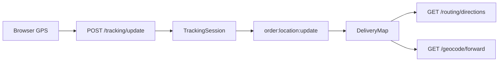

# ELOFix Map Architecture

## Overview

Live delivery maps use **MapLibre GL JS** with **OpenStreetMap** tiles. Routing and forward geocoding are proxied through the Express backend; reverse geocoding for address forms was already backend-based (OpenCage → Nominatim).

Firebase is **auth-only**. Location persistence uses PostgreSQL `TrackingSession` and Socket.IO — not Firestore.

## Component Map

```
DeliveryMap (facade, unchanged props)
  └── MapProvider (lazy-loads maplibre-gl, theme-aware style URL)
        └── MapView (map instance + resize)
        ├── RouteRenderer (GeoJSON line layer)
        ├── MapMarker (driver + destination HTML markers)
        └── MapControls (zoom, center on driver)
```

## Hooks

| Hook | Path | Purpose |
|------|------|---------|
| `useMap` | `frontend/src/hooks/maps/useMap.ts` | Map ref, fitBounds, fitPoints |
| `useRoute` | `frontend/src/hooks/maps/useRoute.ts` | Fetch ORS route via `/routing/directions` |
| `useGeocoder` | `frontend/src/hooks/maps/useGeocoder.ts` | Forward geocode via `/geocode/forward` |
| `useCurrentLocation` | `frontend/src/hooks/maps/useCurrentLocation.ts` | Browser GPS with retry |

## Data Flow



## Consumers (unchanged)

- `UnifiedTrackingSection.tsx`
- `JobDeliverySection.tsx`
- `TrackDelivery.tsx` (public `/track/:trackingId`)

## External Navigation

Provider turn-by-turn links open OpenStreetMap directions via `buildExternalDirectionsUrl()` in `frontend/src/lib/map/externalNavigationUrl.ts`.
